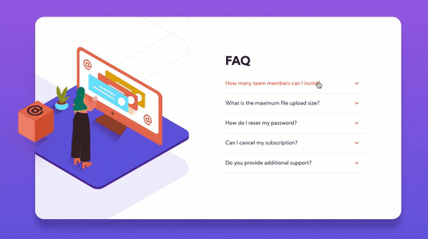

# Frontend Mentor - FAQ accordion card solution

This is a solution to the [FAQ accordion card challenge on Frontend Mentor](https://www.frontendmentor.io/challenges/faq-accordion-card-XlyjD0Oam). Frontend Mentor challenges help you improve your coding skills by building realistic projects.

## Table of contents

-   [Overview](#overview)
    -   [The challenge](#the-challenge)
    -   [Screenshots](#screenshots)
    -   [Links](#links)
-   [My process](#my-process)
    -   [Built with](#built-with)
    -   [What I learned](#what-i-learned)
    -   [Continued development](#continued-development)
    -   [Useful resources](#useful-resources)
-   [Author](#author)
-   [Acknowledgments](#acknowledgments)

## Overview

### The challenge

Users should be able to:

-   View the optimal layout for the component depending on their device's screen size
-   See hover states for all interactive elements on the page
-   Hide/Show the answer to a question when the question is clicked

### Screenshots

-   Desktop

-   Mobile

### Links

-   Solution URL: [Add solution URL here](https://github.com/gdsimoes/faq-accordion-card)
-   Live Site URL: [Add live site URL here](https://gdsimoes.github.io/faq-accordion-card)

## My process

### Built with

-   Semantic HTML5 markup
-   CSS custom properties
-   Flexbox
-   Mobile-first workflow

### What I learned

From the start of this project, I decided as an extra challenge to refrain from using JavaScript. I used the 
 and 
 tags to achieve the desired effect and changed the default behavior using CSS. It was more complicated than I anticipated since I had to deal with unexpected bugs on Chrome and Safari. If I had to do it again, I would use JavaScript, but the silver lining is that I learned a lot about the intricacies of CSS.

### Continued development

For my next project, I will try to practice my JavaScript skills and CSS grid. Restricting myself to a few technologies was enlightening and is occasionally useful, but I also need to practice using the most modern solutions in web development.

### Useful resources

-   [Responsive Web Design with HTML5 and CSS](https://rwd.education/) - This book by _Ben Frain_ is where I first learned that it was possible to make an accordion without using JavaScript.
-   [Code Demo](https://codepen.io/frederickallen/pen/NZMEMw) - This code demo showed me how to change `
` and `
` default behavior and deal with Safari's idiosyncrasies.
-   [Box-shadow generator](https://developer.mozilla.org/en-US/docs/Web/CSS/CSS_Background_and_Borders/Box-shadow_generator) - This is a fantastic tool that helped me generate the values for the `box-shadow` property. I'd recommend it to anyone using this property.
-   [Color contrast accessibility tools](https://css-tricks.com/color-contrast-accessibility-tools/) - This [CSS Tricks](https://css-tricks.com) article contains links to many tools to help choose colors while adhering to accessibility guidelines. It was a life saver and I'm planning on using it on all my other projects.

## Author

-   Website - <https://gdsimoes.com>
-   Frontend Mentor - [@gdsimoes](https://www.frontendmentor.io/profile/gdsimoes)
-   LinkedIn - [Guilherme Dias Simoes](https://www.linkedin.com/in/gdsimoes)

## Acknowledgments

I would like to thank my wife for giving me her opinion on the various design choices on this project.
